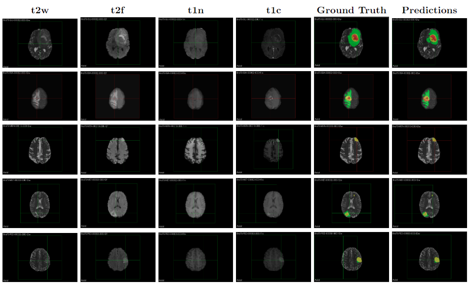

# **nnU-Net For PyTorch** ([Original implementation](https://github.com/NVIDIA/DeepLearningExamples/tree/master/PyTorch/Segmentation/nnUNet))  <!-- omit in toc -->

>#### [Multiscale Encoder and Omni-Dimensional Dynamic Convolution Enrichment in nnU-Net for Brain Tumor Segmentation](https://github.com/i-sahajmistry/nnUNet_BraTS2023.git) (To Be Updated!)
> ##### [Sahaj K. Mistry](https://scholar.google.com/citations?user=54EbWw0AAAAJ&hl=en)

[[Paper]](https://github.com/i-sahajmistry/nnUNet_BraTS2023.git) (To Be Updated!)




## **Dataset**

The training dataset provided for the BraTS21 challenge consists of 1,251 brain mpMRI scans along with segmentation annotations of tumorous regions. The 3D volumes were skull-stripped and resampled to 1 mm isotropic resolution, with dimensions of (240, 240, 155) voxels. For each example, four modalities were given: Fluid Attenuated Inversion Recovery (FLAIR), native (T1), post-contrast T1-weighted (T1Gd), and T2-weighted (T2). See image below with each modality. Annotations consist of four classes: 1 for necrotic tumor core (NCR), 2 for peritumoral edematous tissue (ED), 4 for enhancing tumor (ET), and 0 for background (voxels that are not part of the tumor).

To download the training and validation dataset, you need to have an account on https://www.synapse.org platform and be registered for BraTS21 challenge. We will assume that after downloading and unzipping, the dataset is organized as follows:

```
/data 
 │
 ├───BraTS2021_train
 │      ├──BraTS2021_00000 
 │      │      └──BraTS2021_00000_flair.nii.gz
 │      │      └──BraTS2021_00000_t1.nii.gz
 │      │      └──BraTS2021_00000_t1ce.nii.gz
 │      │      └──BraTS2021_00000_t2.nii.gz
 │      │      └──BraTS2021_00000_seg.nii.gz
 │      ├──BraTS2021_00002
 │      │      └──BraTS2021_00002_flair.nii.gz
 │      ...    └──...
 │
 └────BraTS2021_val
        ├──BraTS2021_00001 
        │      └──BraTS2021_00001_flair.nii.gz
        │      └──BraTS2021_00001_t1.nii.gz
        │      └──BraTS2021_00001_t1ce.nii.gz
        │      └──BraTS2021_00001_t2.nii.gz
        ├──BraTS2021_00002
        │      └──BraTS2021_00002_flair.nii.gz
        ...    └──...
```

# **Model**

We have made some modifications to the U-Net architecture for the BraTS challenge with respect to the original nnU-Net template. In particular, the U-Net template in the nnU-Net has the encoder depth of 6, and the convolution channels at each encoder level are: 32, 64, 128, 256, 320, 320. Based on the experiments we run, increasing the depth of the encoder to 7, modifying the number of channels to: 64, 96, 128, 192, 256, 384, 512, and using deep supervision improves the final score.

For deep supervision, we used two additional output heads at the decoder levels with feature map sizes (64, 64, 64) and (32, 32, 32). To match the shape of the additional predictions with the label shape of (128, 128, 128) we downsampled the label using the nearest neighbor interpolation to the (64, 64, 64) and (32, 32, 32) shapes, so that loss can be computed for additional outputs.


Figure 1: *The final U-Net architecture used for BraTS21 challenge.*

## **Environment**

You can directly use the dockerfile to run the code or use the requirements.txt to install the required dependencies.

## **Training** 

Now, let's start training the model. For that, we will call the training script from our nnUNet repo with some additional command line arguments for BraTS challenge: 

- `--brats` - use loss function with partially overlapping regions (WT, TC, ET) and BraTS specific inference;
`--brats22_model` - use UNet3D model designed for BraTS22 edition;
- `--deep_supervision` - use deep supervision loss with two additional output heads;
- `--more_chn` - create encoder with more channels than regular U-Net;
- `--min_fmap 2` - create deeper encoder, with feature map size in the bottleneck 2x2x2;

and the regular command line arguments:

- `--scheduler` - use cosine decay learning rate scheduler with warm up 250 steps of warm up;
- `--learning_rate 0.0003` - initial learning rate after warm up will be set to 0.0003;
- `--epochs 30` - training will be done for 30 epochs;
- `--fold 0` - training will be done for fold 0 (by default, 5-fold cross validation is used);
- `--amp` - training with automatic mixed precision, for faster training and memory reduction;
- `--gpus 1` - one GPU will be used during training;
- `--task 11` - task number for BraTS21 training dataset. See file `data_preprocessing/configs.py` for more details;
- `--save_ckpt` - save checkpoint with highest dice score acheived during training.

- `--odconv` - replace convolution layers with omni dimentional convolution layers
- `--multiscale` - use multiscale strategy for training.

```cmd 
python ../main.py --brats --deep_supervision --depth 6 --filters 64 96 128 192 256 384 512 --min_fmap 2 --scheduler --learning_rate 0.0003 --epochs 30 --fold 0 --amp --gpus 1 --task 11 --save_ckpt
```
> For detailed information about dataset preparation and training see these [notebooks](https://github.com/i-sahajmistry/nnUNet_BraTS2023/tree/master/notebooks).

## **Results**
Scores of modified nnU-Net on testing datasets in Brats 2023 Challenge:
| Challenge | Lesion ET | Lesion TC | Lesion WT |
|:----------|:---------:|:---------:|:---------:|
| Adult Glioma Segmentation | 0.798 | 0.826 | 0.789 |
| BraTS-Africa Segmentation | 0.818 | 0.775 | 0.845 |
| Meningioma Segmentation | 0.799 | 0.773 | 0.763 |
| Brain Metastases Segmentation | 0.491 | 0.534 | 0.483 |
| Pediatric Tumors Segmentation | 0.480 | 0.320 | 0.347 |

## **Citation**
```
To Be Updated!

```
